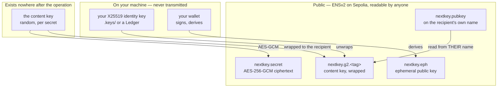
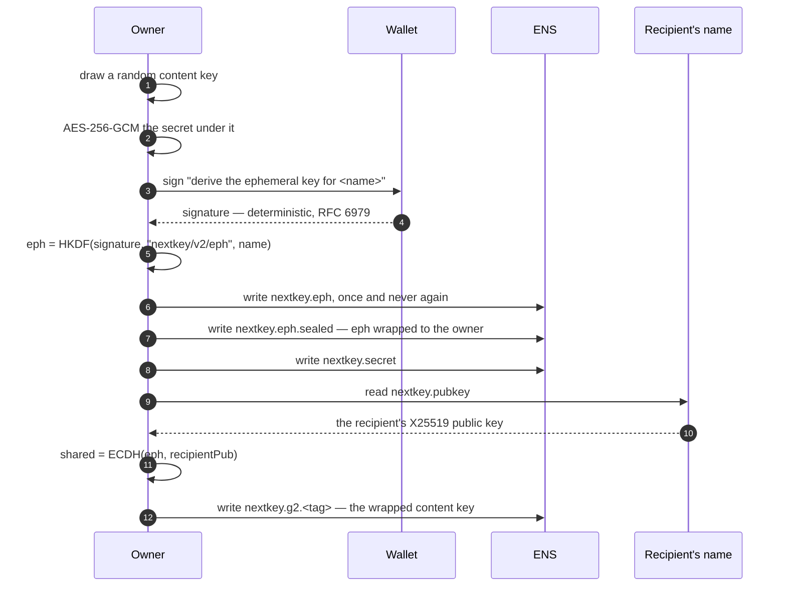
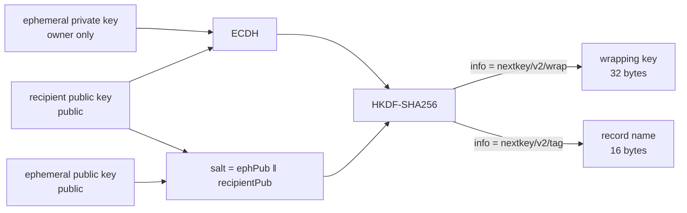
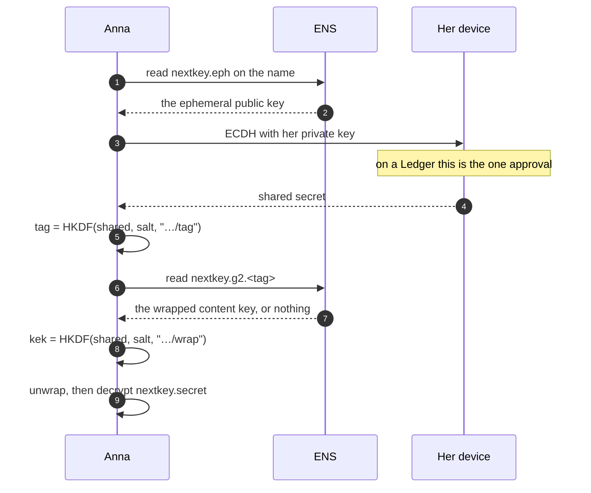
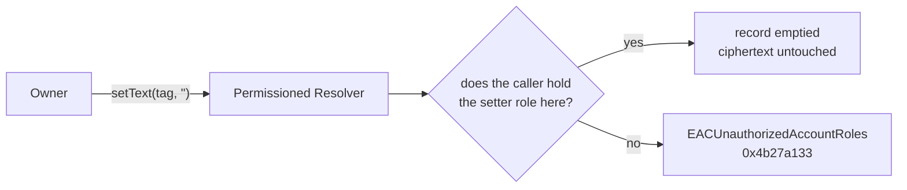
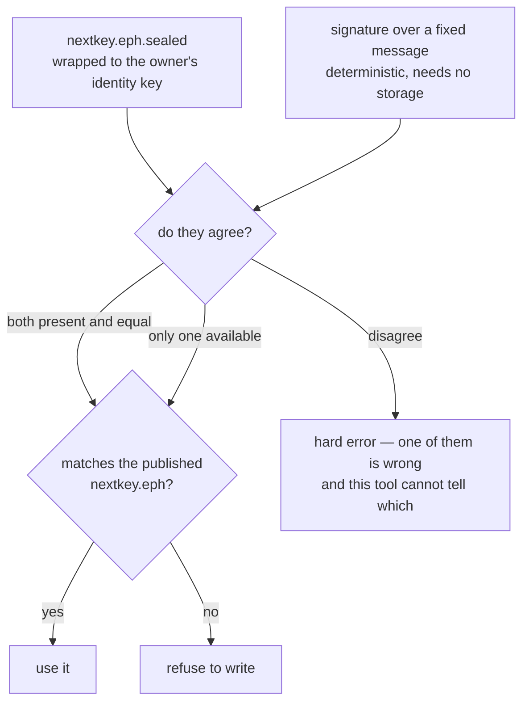
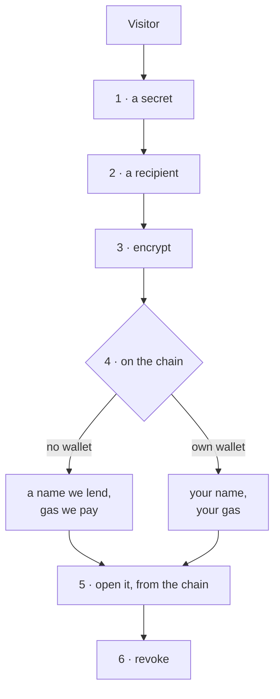

# Architecture

How NextKey is put together, and — more usefully — where its boundaries are.

The one sentence the rest of this document elaborates:

> **Confidentiality comes from cryptography. Control comes from protocol roles.
> Nothing comes from a server of ours, because there isn't one.**

Conflating those two is how a design ends up claiming that a public chain keeps
secrets. It does not, and no chain could: everything written to ENS is readable
by everyone, forever. What ENS enforces is *who may write* — and that turns out
to be enough for the half of the problem it is asked to solve.

---

## Where everything lives

Three properties fall out of this picture and are worth stating before the
diagrams that follow.

**We hold nothing.** There is no database, no key escrow, no account. Take
`nextkey.li` offline and every secret in the system remains readable by exactly
the people who could read it before, using the command-line tool against ENS.

**The recipient never registers.** Her public key is a text record on her own
name. Encrypting to her requires her name and nothing else — no invitation, no
account, not even her knowledge.

**The owner is a recipient like any other.** No master key, no owner-only branch
in the code. The honest cost: lose your identity key and the secret is gone. We
would rather say that than hold a key we promise not to use.

---

## Storing a secret

The signature in step 3 is not a transaction and authorises nothing. It exists
so that the ephemeral key can be reproduced later, on any machine, with nothing
stored — see *Two ways back* below.

---

## The part that is new: where a grant lives

Version 1 stored a grant at `nextkey.grant.<first 16 hex of sha256(recipientPub)>`.
Addressing by key rather than by name was right — names move, keys do not. The
address was the mistake: it is a pure function of a **public** value, so anyone
holding a recipient's published key could check any name on the deployment for a
grant to them.

The ciphertext was never the leak. The record name was, and it published the
guest list of every secret in the system.

The same shared secret, two info strings, two independent outputs. Publishing
the tag on chain therefore says nothing about the wrapping key.

Who can compute the address:

| | v1 | v2 |
|---|---|---|
| The recipient | yes | yes — one scalar multiplication |
| The name's owner | yes | yes — they hold the ephemeral private key |
| Anyone holding the recipient's public key | **yes** | no |
| Anyone at all | no | no |

The recipient's single ECDH yields both the address to read and the key to
unwrap what is there. That is why a hardware wallet is asked to approve once
rather than twice, and it is the reason one ephemeral pair serves the whole name
instead of one per recipient: each recipient's ECDH lands somewhere else, so two
grants share no key material.

**What it costs.** A v2 name in the ENS explorer no longer reads as anything —
an ephemeral key, a ciphertext, and records whose names are 32 hex characters.
A working name looks identical to a broken one, which is why `nextkey.mjs eph`
exists to answer the two questions the explorer cannot: which scheme, and is the
ephemeral key still recoverable.

---

## Opening it

Nobody told Anna where to look. She read one public value off the name and
derived the address from it with her own key.

If step 7 returns nothing, she learns nothing: not that a grant was withdrawn,
not that one ever existed. A stranger running the identical procedure arrives at
a different address, which is also empty — she never reaches a decryption she is
refused.

---

## Revoking

Clear the grant record. The ciphertext stays.

Two things this is, and one it is not.

It **is** enforced by the resolver's role model rather than by us: who may clear
that record is protocol state, not our opinion. (Expiry is the registry's
department — a separate mechanism, and the reason a shared secret can stop
resolving without anybody doing anything.) It **is** findable without an index — the
owner recomputes the recipient's address from that recipient's published key,
which is the same asymmetry that hides it from everyone else.

It is **not** a retraction of knowledge. Anyone who already decrypted the secret
still knows it. No system can undo that, and one that claims to is selling
something.

---

## Two ways back to the ephemeral key

A name is frozen the moment its ephemeral private key is lost: no second
recipient can ever be added, because nobody can compute where their grant
belongs. So there are two independent routes, and losing either alone costs
nothing.

The second route rests on deterministic signing. RFC 6979 says ECDSA as Ethereum
uses it derives its nonce from the key and the message, so a signature is
reproducible — but *the specification says so* and *this wallet does so* are
different claims, and only the second one matters. `scripts/probe-signing.mjs`
measures it. It was also confirmed on chain, where both routes independently
produced the same 32 bytes on a real name.

The check in the last box is not decoration. It fired on a real name:
`hero06.nextkey.eth` was written by the browser using the page's own key, so the
registrar's wallet derives something else — and the tool refuses rather than
writing grants at addresses nobody will ever read.

---

## Roles on the deployment

Each secret is a subname: an ERC-1155 token with one owner, its own resolver,
its own roles, its own expiry. Sharing, expiry and revocation are protocol
operations rather than rows in a table.

**The second resolver exists because of a limit worth knowing about.**
`grantSetterRoles` binds a permission to *(setter, name, record key)* — genuinely
fine-grained, and unusable for a schema whose keys are computed at run time. A
v2 grant lives at `nextkey.g2.<tag>`, and the tag comes out of an ECDH performed
in the visitor's browser: there is no role to grant because there is no key to
name. Root roles on a resolver of their own were the way through. The blast
radius then follows from which resolver a name uses rather than from an
enumeration of grants — coarser than we wanted, and bounded by construction.
Written up as finding 11 in [`FEEDBACK-ENS.md`](../FEEDBACK-ENS.md).

---

## The playground, and why it carries a private key

Steps 1 to 3 need no wallet, no account and no ether; nothing leaves the tab.
Steps 5 and 6 read the records back through the Universal Resolver rather than
out of memory, because a refusal computed locally proves less than one that
survives a round trip through ENS.

The left-hand lane at step 4 is why a private key is published in
`web/src/demo-wallet.js`. A judge on a phone has no extension; one with an
extension has no Sepolia ether; both are dead ends at the only step that touches
a chain, and a page nobody can finish demonstrates nothing.

That key **owns nothing**. It holds a few cents of testnet ether and root roles
on the one resolver the lent names use — so it can write records there and
nowhere else. It cannot transfer a name, cannot grant anything, cannot touch
`visa.nextkey.eth` or any name you own. Anyone can read it and spend its ether,
at which point the page falls back to the other lane and we refill it. That is
the whole downside, and it is disclosed on the page rather than hoped over: a
demo of a security product that relies on nobody looking is not a demo of
anything.

---

## What an observer can and cannot determine

Assume the strongest realistic adversary: they have read every public value in
the system, including the name's ephemeral key and the published key of anybody
they care about.

| | |
|---|---|
| That a name holds a secret | **yes** — `nextkey.secret` is right there |
| Roughly how many records it carries | **yes** |
| The plaintext | no — AES-256-GCM under a key they do not have |
| Whether the secret is shared with a particular person | no, and no query would tell them |
| Which record belongs to whom | no — the address comes out of an ECDH |
| That access was revoked rather than never granted | no — both are an empty record |

The last two rows are what version 2 bought. The first two are the honest cost
of putting anything on a public chain, and no amount of design removes them.

**What we could do, if we wanted to.** We own the lent names, so we can write to
them; a visitor using that lane is trusting us with a demonstration, not with a
secret, and the page says so. We can also stop paying for `nextkey.li`, which
would change nothing about any record already written.

**What we could not do even if compelled.** Decrypt anything. There is no key to
hand over.

---

## What is not built

Stated here rather than left for a reader to discover.

**World ID Selfie Check** is designed and not implemented — sandbox access never
arrived. Recovery therefore describes a flow rather than demonstrating one; the
README marks it the same way.

**The notification channel** is a text record and a small local notifier, run by
hand for the demo. It is not a deployed service and is not described as one.

**The release agent** runs locally. Its ENS namespace, its single delegated role
and the boundary it cannot cross are real and on chain; the process that drives
them is a script on a laptop.

**Storage is a text record.** Small secrets — a passphrase, a seed phrase — fit.
Files do not, and would need IPFS or similar. That is a stretch goal and was
never started, which is why nothing here mentions pinning.
