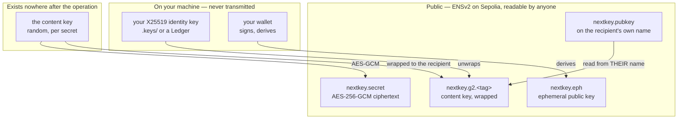
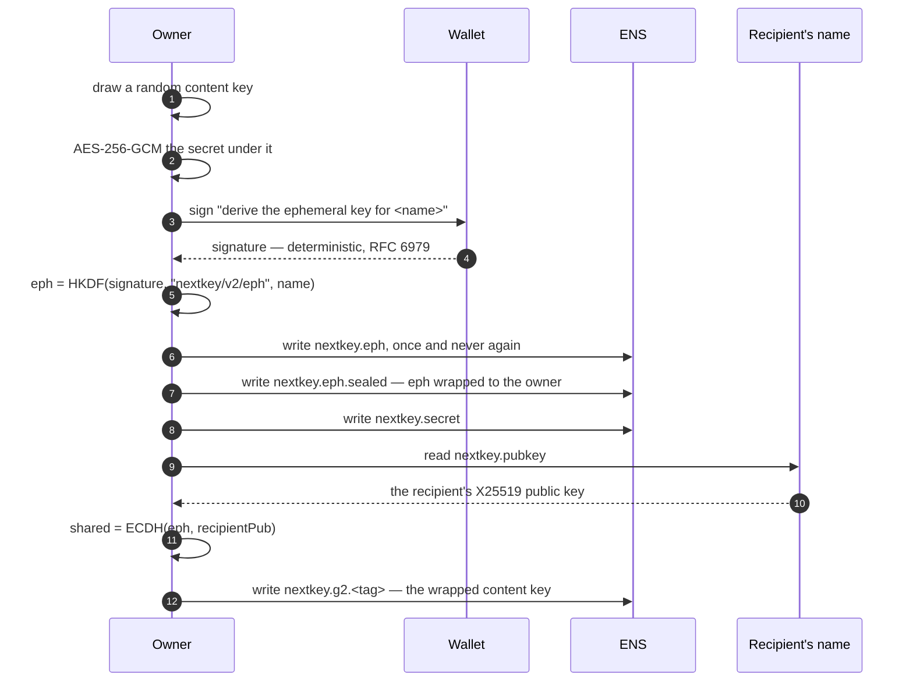
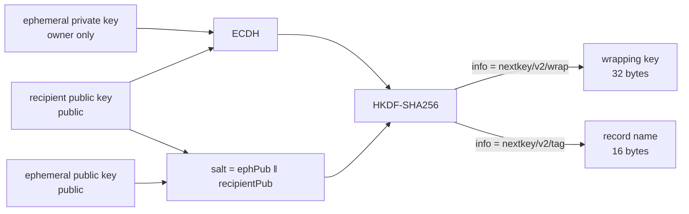
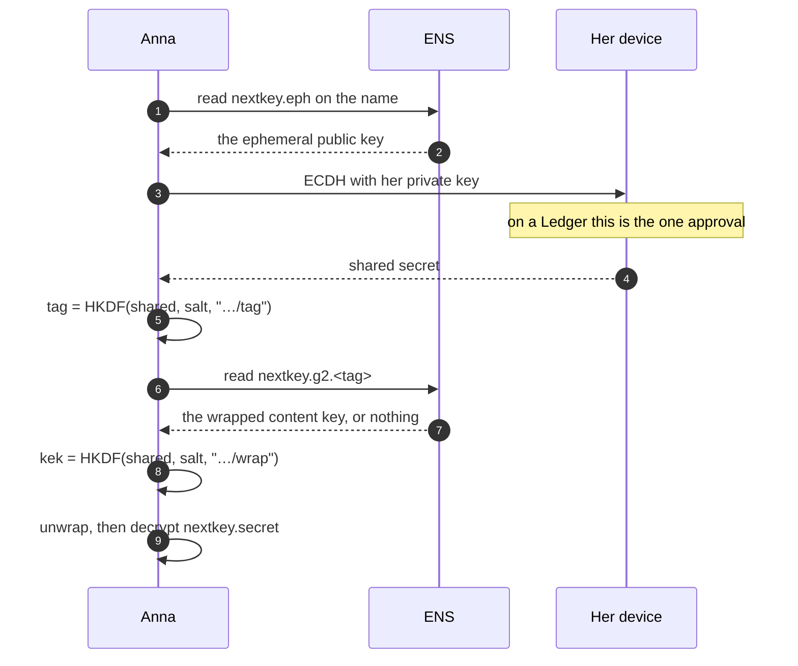
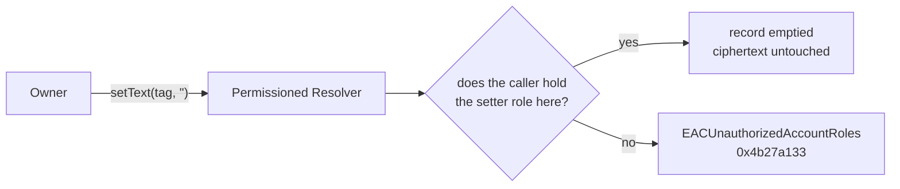
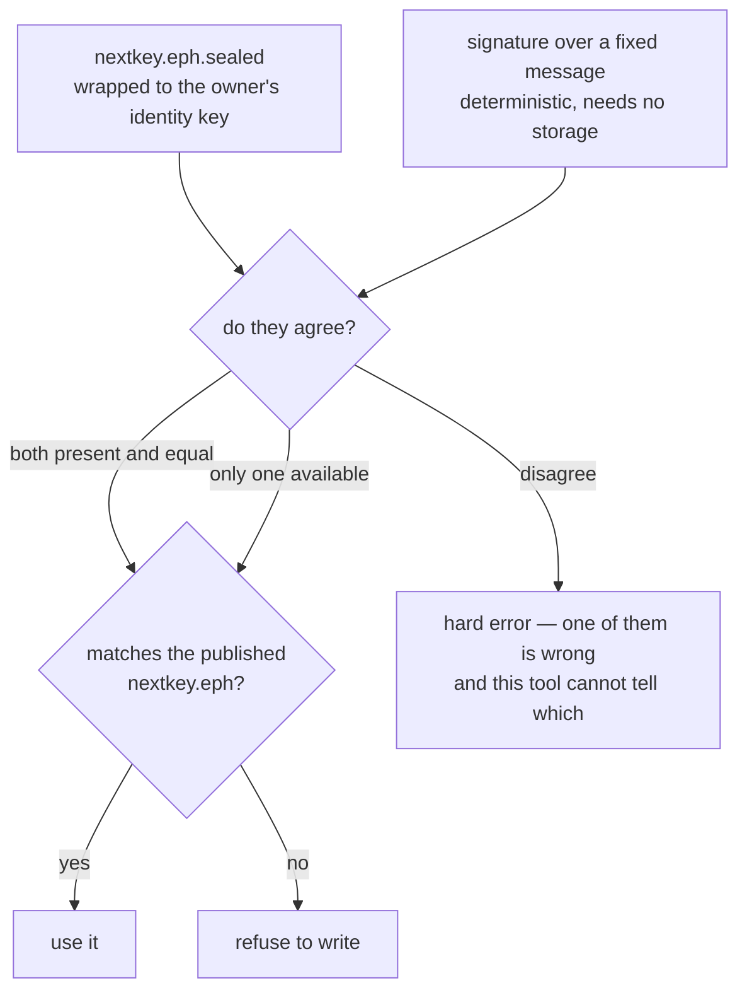
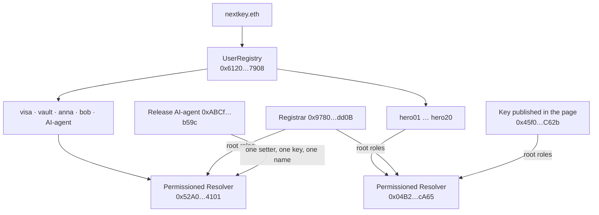
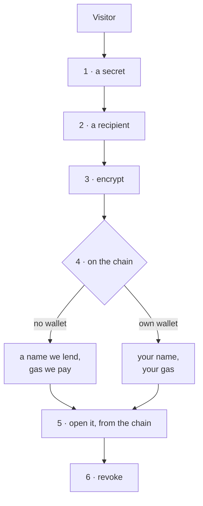

# Architecture

How NextKey is put together, and — more usefully — where its boundaries are.

The one sentence the rest of this document elaborates:

> **Confidentiality comes from cryptography. Control comes from protocol roles.
> Nothing comes from a server of ours, because there isn't one.**

Conflating those two is how a design ends up claiming that a public chain keeps
secrets. It does not, and no chain could: everything written to ENS is readable
by everyone, forever. What ENS enforces is *who may write* — and that turns out
to be enough for the half of the problem it is asked to solve.

---

## Where everything lives

Three properties fall out of this picture and are worth stating before the
diagrams that follow.

**We hold nothing.** There is no database, no key escrow, no account. Take
`nextkey.li` offline and every secret in the system remains readable by exactly
the people who could read it before, using the command-line tool against ENS.

**The recipient never registers.** Her public key is a text record on her own
name. Encrypting to her requires her name and nothing else — no invitation, no
account, not even her knowledge.

**The owner is a recipient like any other.** No master key, no owner-only branch
in the code. The honest cost: lose your identity key and the secret is gone. We
would rather say that than hold a key we promise not to use.

---

## Storing a secret

The signature in step 3 is not a transaction and authorises nothing. It exists
so that the ephemeral key can be reproduced later, on any machine, with nothing
stored — see *Two ways back* below.

---

## The part that is new: where a grant lives

Version 1 stored a grant at `nextkey.grant.<first 16 hex of sha256(recipientPub)>`.
Addressing by key rather than by name was right — names move, keys do not. The
address was the mistake: it is a pure function of a **public** value, so anyone
holding a recipient's published key could check any name on the deployment for a
grant to them.

The ciphertext was never the leak. The record name was, and it published the
guest list of every secret in the system.

The same shared secret, two info strings, two independent outputs. Publishing
the tag on chain therefore says nothing about the wrapping key.

Who can compute the address:

| | v1 | v2 |
|---|---|---|
| The recipient | yes | yes — one scalar multiplication |
| The name's owner | yes | yes — they hold the ephemeral private key |
| Anyone holding the recipient's public key | **yes** | no |
| Anyone at all | no | no |

The recipient's single ECDH yields both the address to read and the key to
unwrap what is there. That is why a hardware wallet is asked to approve once
rather than twice, and it is the reason one ephemeral pair serves the whole name
instead of one per recipient: each recipient's ECDH lands somewhere else, so two
grants share no key material.

**What it costs.** A v2 name in the ENS explorer no longer reads as anything —
an ephemeral key, a ciphertext, and records whose names are 32 hex characters.
A working name looks identical to a broken one, which is why `nextkey.mjs eph`
exists to answer the two questions the explorer cannot: which scheme, and is the
ephemeral key still recoverable.

---

## Opening it

Nobody told Anna where to look. She read one public value off the name and
derived the address from it with her own key.

If step 7 returns nothing, she learns nothing: not that a grant was withdrawn,
not that one ever existed. A stranger running the identical procedure arrives at
a different address, which is also empty — she never reaches a decryption she is
refused.

---

## Revoking

Clear the grant record. The ciphertext stays.

Two things this is, and one it is not.

It **is** enforced by the resolver's role model rather than by us: who may clear
that record is protocol state, not our opinion. (Expiry is the registry's
department — a separate mechanism, and the reason a shared secret can stop
resolving without anybody doing anything.) It **is** findable without an index — the
owner recomputes the recipient's address from that recipient's published key,
which is the same asymmetry that hides it from everyone else.

It is **not** a retraction of knowledge. Anyone who already decrypted the secret
still knows it. No system can undo that, and one that claims to is selling
something.

---

## Two ways back to the ephemeral key

A name is frozen the moment its ephemeral private key is lost: no second
recipient can ever be added, because nobody can compute where their grant
belongs. So there are two independent routes, and losing either alone costs
nothing.

The second route rests on deterministic signing. RFC 6979 says ECDSA as Ethereum
uses it derives its nonce from the key and the message, so a signature is
reproducible — but *the specification says so* and *this wallet does so* are
different claims, and only the second one matters. `scripts/probe-signing.mjs`
measures it. It was also confirmed on chain, where both routes independently
produced the same 32 bytes on a real name.

The check in the last box is not decoration. It fired on a real name:
`hero06.nextkey.eth` was written by the browser using the page's own key, so the
registrar's wallet derives something else — and the tool refuses rather than
writing grants at addresses nobody will ever read.

It has also passed where it should. `nextkeyv2.eth` carries no sealed record, so
its ephemeral key can only come from the derivation — and the signature viem
produces matches the `nextkey.eph` that MetaMask's signature published. The same
key through two entirely separate signer implementations, agreeing on the same
32 bytes, verified against what the chain already held. That is the assumption
this fallback rests on, measured rather than cited.

---

## Roles on the deployment

Each secret is a subname: an ERC-1155 token with one owner, its own resolver,
its own roles, its own expiry. Sharing, expiry and revocation are protocol
operations rather than rows in a table.

**The second resolver exists because of a limit worth knowing about.**
`grantSetterRoles` binds a permission to *(setter, name, record key)* — genuinely
fine-grained, and unusable for a schema whose keys are computed at run time. A
v2 grant lives at `nextkey.g2.<tag>`, and the tag comes out of an ECDH performed
in the visitor's browser: there is no role to grant because there is no key to
name. Root roles on a resolver of their own were the way through. The blast
radius then follows from which resolver a name uses rather than from an
enumeration of grants — coarser than we wanted, and bounded by construction.
Written up as finding 11 in [`FEEDBACK-ENS.md`](../FEEDBACK-ENS.md).

---

## The playground, and why it carries a private key

Steps 1 to 3 need no wallet, no account and no ether; nothing leaves the tab.
Steps 5 and 6 read the records back through the Universal Resolver rather than
out of memory, because a refusal computed locally proves less than one that
survives a round trip through ENS.

The left-hand lane at step 4 is why a private key is published in
`web/src/demo-wallet.js`. A judge on a phone has no extension; one with an
extension has no Sepolia ether; both are dead ends at the only step that touches
a chain, and a page nobody can finish demonstrates nothing.

That key **owns nothing**. It holds a few cents of testnet ether and root roles
on the one resolver the lent names use — so it can write records there and
nowhere else. It cannot transfer a name, cannot grant anything, cannot touch
`visa.nextkey.eth` or any name you own. Anyone can read it and spend its ether,
at which point the page falls back to the other lane and we refill it. That is
the whole downside, and it is disclosed on the page rather than hoped over: a
demo of a security product that relies on nobody looking is not a demo of
anything.

---

## What an observer can and cannot determine

Assume the strongest realistic adversary: they have read every public value in
the system, including the name's ephemeral key and the published key of anybody
they care about.

| | |
|---|---|
| That a name holds a secret | **yes** — `nextkey.secret` is right there |
| Roughly how many records it carries | **yes** |
| What *kind* of secret it is, from the ciphertext's length | **no longer** — see below |
| The plaintext | no — AES-256-GCM under a key they do not have |
| Whether the secret is shared with a particular person | no, and no query would tell them |
| Which record belongs to whom | no — the address comes out of an ECDH |
| That access was revoked rather than never granted | no — both are an empty record |

**The length row used to read yes.** AES-GCM does not pad, so a ciphertext is
exactly as long as its plaintext and the ciphertext is a public record: a
twelve-word phrase and a two-paragraph message are distinguishable without
decrypting either. Our own explorer made it visible by printing the character
count, which is how it was noticed. Hiding the number would have hidden the
symptom; the secret is now padded to 256-byte blocks before sealing, so every
passphrase, credential and short message comes out the same size.

Honest about the residue: a very long secret still lands in a higher block, so
the length is coarse rather than absent. Only the payload is padded — the wrapped
keys are fixed-length key material already, and padding them would triple three
records that leak nothing. Unpadding strips trailing NUL bytes, so records
written before padding existed still open unchanged, and the one thing lost is a
secret that deliberately ends in NUL bytes, which is not something a passphrase,
a key or a typed message contains.

The last two rows are what version 2 bought. The first two are the honest cost
of putting anything on a public chain, and no amount of design removes them.

**What we could do, if we wanted to.** We own the lent names, so we can write to
them; a visitor using that lane is trusting us with a demonstration, not with a
secret, and the page says so. We can also stop paying for `nextkey.li`, which
would change nothing about any record already written.

**What we could not do even if compelled.** Decrypt anything. There is no key to
hand over.

---

## Reading it back out

Three pages show history — one name's writes, every record NextKey has made, the
community's posts — and none of them has a server or an index. All three stand on
two events on the resolver, read off the deployment rather than guessed at:

| Topic | What it is |
|---|---|
| `0x66fd1d4e…` | a record being created. topic1 = record id, topic2 = `namehash(name)` |
| `0x14cf4389…` | `TextUpdated(uint256 recordId, string indexed key, string key, string value)` |

Two properties of the second one decide what these pages can say.

**The key is in the data as well as indexed.** So a line can print
`nextkey.g2.251c75…` in full rather than confirming a hash somebody already
guessed. Had it been indexed only, no page could ever *show* a grant record — it
could only test a name it had already thought of, which is the v1 attack wearing
a different hat.

**Record id ↔ namehash runs one way.** A name gives a namehash; a namehash never
gives back a name. This is why the live window can say a grant was given and
cannot say to whom, and why a community post carries an author only when its
creation event can be found and matched. It is the same one-way property the
whole design rests on, met from the other side.

**What an indexer would add, and why there isn't one.** Counting every grant on a
name, listing every name in the world that carries a post, showing incoming ETH
donations: each needs an index over events, which a page served from static files
does not have. Every one of those places says so rather than showing a number
that would be quietly incomplete.

**A limit of the public endpoint, not of the design.** Public RPCs refuse wide
log ranges. Each walk probes for the widest window the node will serve, reports
how far back it actually looked, and prints a refusal as a refusal — because "the
node would not answer" and "there is nothing there" are different statements, and
a page that cannot tell them apart will eventually tell somebody the wrong one.

---

## What is not built

Stated here rather than left for a reader to discover.

**Recovery after a total loss** is designed and not implemented. It describes a
flow — guardians confirming that the person asking is the person who lost the
key — rather than demonstrating one, and the README marks it the same way.

**The notification channel** is a text record and a small local notifier, run by
hand for the demo. It is not a deployed service and is not described as one.

**The release AI-agent** runs locally. Its ENS namespace, its single delegated role
and the boundary it cannot cross are real and on chain; the process that drives
them is a script on a laptop.

**No indexer.** Grant counts, a global list of posts and incoming ETH donations
all need one. Each place that would want it says what it cannot show instead.

**Storage is a text record.** Small secrets — a passphrase, a seed phrase — fit.
Files do not, and would need IPFS or similar. That is a stretch goal and was
never started, which is why nothing here mentions pinning.

## How this scales

The thing that decides whether NextKey is a demonstration or a product is not
the cryptography. It is this: **you cannot encrypt to a name that publishes no
key**, and until 9 September being publishable cost four separate things.

| The wall | Why people do not climb it |
|---|---|
| Generate a key | A brand-new secret, in a file, that nobody backs up |
| Keep it for ever | Losing it costs every secret ever sent to them |
| Own an ENS name | A registration, a wallet, a decision |
| Pay for a transaction | Gas, on a chain they may never have used |

An Ethereum address does not help: it is the *hash* of a key, so nothing can be
encrypted to one. The public key behind an address can be recovered from any
signature that address ever made — but the recipient would then need software
that decrypts with their account key, and no common wallet still offers that.
Sending would work; opening would not, which is worse than refusing.

### What is built

**The key is derived, not generated.** `identityMessage()` is signed once with
the wallet the person already has; HKDF over that signature with the info string
`nextkey/v2/identity` yields their X25519 secret. The first two walls disappear
together: nothing is created, so nothing has to be kept, and the same wallet
returns the same key on any machine for ever. The message carries no name — an
identity belongs to a wallet — so the key is unchanged when they move to another
name later.

**The name and the gas are lent.** The playground picks a free pool name and
writes `nextkey.pubkey` with its own account. What is left of the four walls is:
connect a wallet, sign once, no gas.

**And a first secret can reach somebody with nothing.** A throwaway recipient
key, made in the browser, travels in the URL fragment; the ciphertext and the
grant sit on chain as always. Whoever holds that link can open the secret once —
so it is a link-shaped secret and is described as one — and the person who opens
it is offered a published key of their own. Each secret sent this way can leave
behind a recipient who never needs a link again.

### And the name can be theirs

The lent name is **ours, not theirs**: they can receive on it, they cannot
change its records, and nothing but our own restraint stops us overwriting them.
So the playground offers a second lane underneath, and `contracts/NextKeyNames.sol`
is what makes it safe to offer.

`claim(label, to, pubkey)` registers a subname in the `UserRegistry` whose
**owner is their address**, gives them `SET_RESOLVER` and `SET_SUBREGISTRY`, and
publishes `nextkey.pubkey` on it — one transaction, signed and paid for by the
person receiving the name. The identity is unchanged by the move, because it
hangs on the wallet and not on the name: the same signature over the same
message gives the same key, whichever name carries it.

**Why a contract and not a key.** `ROLE_REGISTRAR` is one bit. A key holding it
may register as often as its balance allows, and "one name per address" written
into a web page binds only the people who use the page. The contract holds the
role instead, and the rules are where the chain enforces them: one name per
address for ever, a hard cap, a deny list, a pause. It holds no funds, cannot
transfer or edit a name, and cannot take one back — revoking its roles or losing
its operator key leaves every name already handed out exactly where it is.

**Two roles, not one.** Owning a name turned out not to include being able to
use it: on this deployment's resolver, writing a text record needs
`ROLE_SET_TEXT`, granted at the root and not per name, so the new owner cannot
publish anything. The contract therefore holds that role too and writes the
record itself, for the name it created moments earlier in the same call. It is
the same role the demo page's key already has — the difference is that a key is
bounded by whoever holds it and a contract is bounded by its code.

### What is still not theirs

`ROLE_SET_TEXT` at the root of that resolver means this project *could*
overwrite the key on a name it handed out. The page says so where the good news
is, not in a footnote, and names the way out: point the name at a resolver you
control and even that stops being true.

The lent lane stays, and stays first. It costs one signature and no gas, which
is the difference between a stranger trying this and a stranger leaving; the
owned name costs a transaction they pay for, and on a testnet most visitors have
nothing to pay it with. Offering only the second would turn those people away.
Offering only the first would mean nobody ever owns anything.
